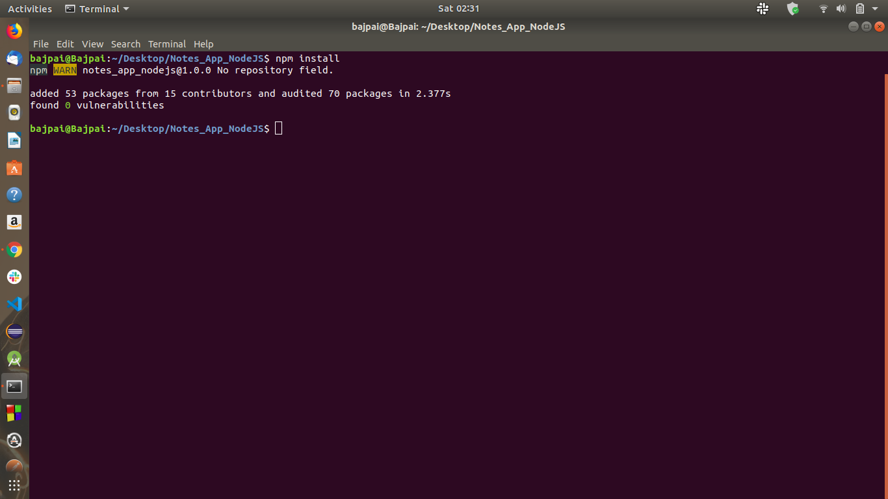
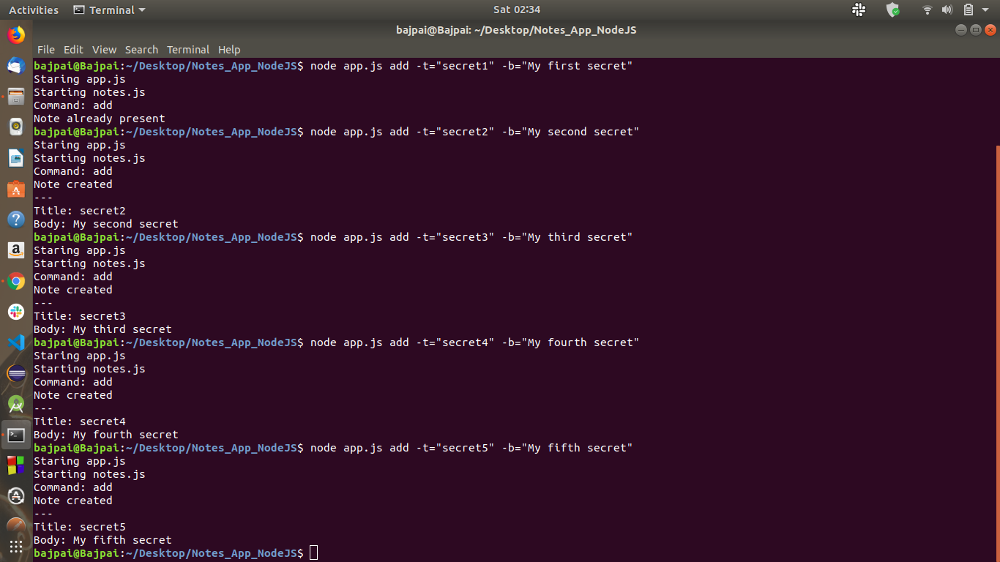
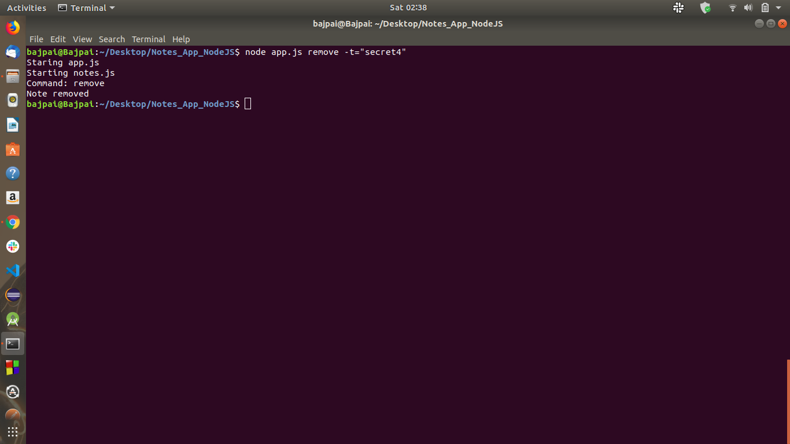
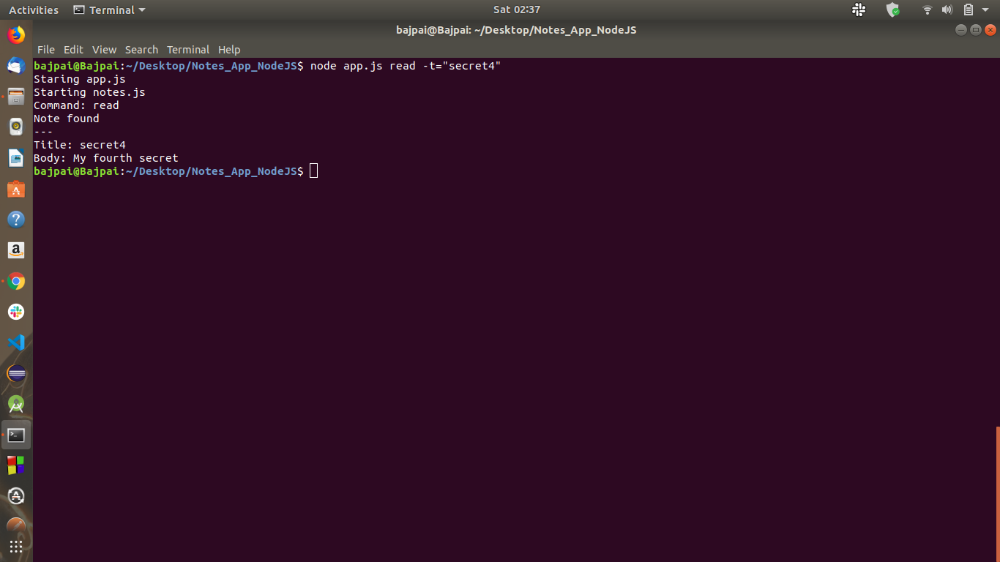
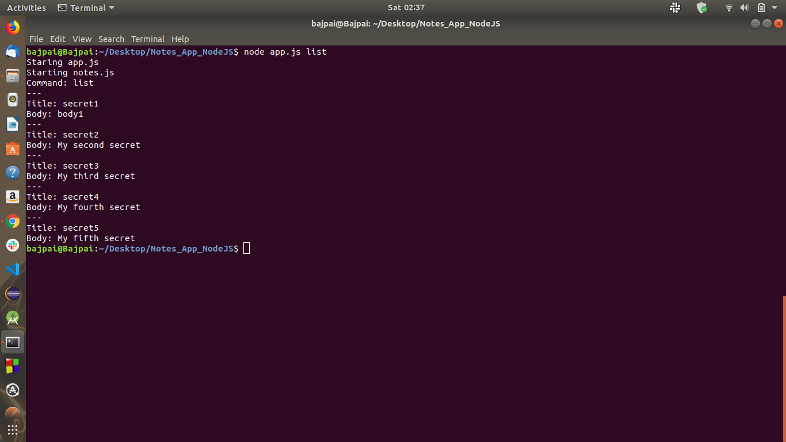

# Notes taking App

First of all since it is a node project so you will be requiring the some inbuilt as well as third-party modules which had been used in this project. So to have them execute the below command and all the required packages will be downloaded in node_modules folder.

## To add the node_modules:

### npm install

It helps you in keeping your notes easily in a file and doing whatever you want them like if you want to add the new note,or remove an existing note, or see all the notes, or read a particular note. So the commands for the same are:

## To Add a new note:

### node app.js add -t="title" -b="content"
  

where add is command which we are writing for adding a new note and "-t" which is an option tag to give the note a title and "-b" which is also an option tag to give the contents of note and make sure to enclose both of them inside the double quotes("") as shown "title" and "content".
  
## To Delete an existing note:

### node app.js remove -t="title"
  

  
where remove is command for deleting a note "title" as a title and make sure to enclose it inside the double quotes("") as shown.
  
## To Read a particular note:

### node app.js read -t="title"
  

  
where read is command for reading a note "title" as a title and make sure to enclose it inside the double quotes("") as shown.

## To See the List of notes:

### node app.js list

where list is command for seeing all the notes taken along with their title and contents.
